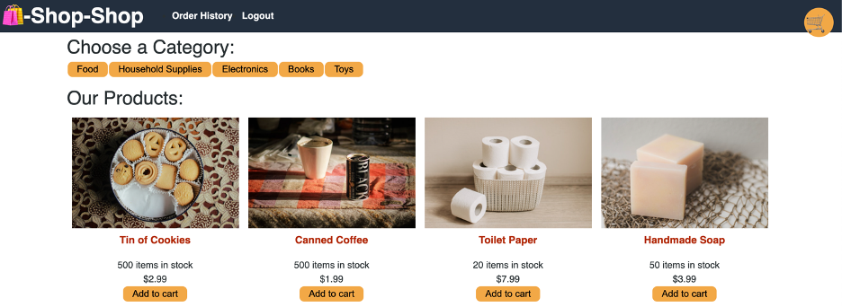

# shop-shop
    
## Description 
MERN application that allows users to sign up or login to a virtual store. The products can be added and removed from your shopping cart. 

## Table of Contents 
* [Installation](#installation)
* [Usage](#usage)
* [Credits](#credits)
* [License](#license)

## Installation 
Git clone the repo to your local hardware. In the command line at the root directory after cloning, type "npm install" to download all of the dependency packages. Type "npm start" to start the local server to use in local environment only. 

## Usage 
To view and use the app, visit the live webpage at:

### https://lit-retreat-83042.herokuapp.com/

    
## Credits 
UofA Coding Bootcamp

## License 
MongoDB, Mongoose, Express.js, React.js, Node.js, Stripe, IndexedDB

## Contributing 
There is not contributing at this time. 

